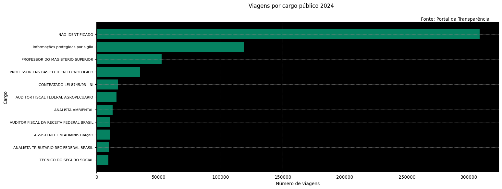

# viagens-por-cargo-publico-2024
Repositório para o script criado durante o curso "Python para dados: do zero à análise completa", Asimov Academy.

Durante o curso, foram abordados tópicos como: 

- Consultar e manipular colunas em tabelas;
- Realizar operações entre colunas e trabalhar com diferentes tipos de dados;
- Contar frequências e criar novas tabelas agrupando dados;
- Aplicar séries booleanas e filtros para análises mais precisas;
- Lidar com dados nulos e trabalhar com datas;
- Combinar agregações e filtros para gerar insights relevantes;
- Criar e customizar gráficos para visualização de informações;
- Explorar dados e realizar união de tabelas;
- Salvar resultados e construir análises finais.

Resultado:

Fonte de dados: Portal da Transparência do Brasil (https://portaldatransparencia.gov.br/)
